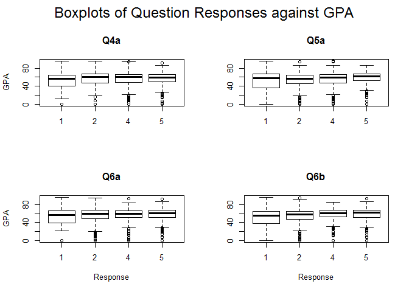

# Can survey data be used as an indicator of learning outcomes?
Karl Molden, Veronika Hulikova  
25 January 2016  

## Synopsis

The aims of this project are to show that the results of work done by [Sheffield Hallam University](https://www.heacademy.ac.uk/sites/default/files/resources/2.3%20Using%20UKES%20results%20and%20institutional%20award%20marks%20to%20explore%20the%20relationship%20between%20student%20engagement%20and%20academic%20achievement.pdf)  showing a small but statistically significant relationship between responses to the HEA's UK Engagement Survey (UKES) and academic outcomes could be:

* Recreated with similar data from the University of Greenwich
* Extended from an annual survey to course level surveys conducted each term, and so potentially be useful as part of a learning analytics dataset

As such a dataset containing responses to the University Student Survey (USS), which from the 2014 session contains the UKES questions as a subset of the whole survey, was matched to a student dataset containing the Grade Point Average (GPA) and a second dataset containing responses to course evaluation surveys was matched to a dataset containing course grades.

Regression analysis was performed on the matched data to identify if correlations exist between responses to questions and GPA/course grades.

The headline results of this analysis are that:

* There are small but statistically significant correlations between UKES responses and academic outcomes
* We can find similar relationships between course evaluation data and academic outcome

## Data Processing

Whilst this is tailored to the Greenwich data sets, it should be straightforward to adapt to other, similar data.  For both the annual USS survey data the processing is essentially the same:

* Match survey data with academic outcome data
* Filter data to the set needed to work with
* Perform any re-coding necessary to make the data comprehensible

Firstly, we need to ensure R has the correct packages installed.


```r
library(dplyr)
library(car)
library(ggplot2)
```

Next, the USS survey data needs to be matched to the student dataset which contains academic outcome - GPA.


```r
setwd("C:\\Users\\mk77\\jisc_micro_project")


### Read in the 2014 University Student Survey data
all_rows <- readLines("USS 2014 Main.csv")
sd_2014_desc <- all_rows[2]
skip_second <- all_rows[-2]

sd_2014 <- read.csv(textConnection(skip_second), header = TRUE, stringsAsFactors = FALSE)

### Read in the 2014 student data
stu_d_2014 <- read.csv("2014_stu_data.csv")

### Select the rows within the student data which we're interested in.
stu_gpa_2014 <- stu_d_2014 %>% select(BANNER_ID_NUMHUS, Stage.GPA, Most.recent.progress, Enroll.status, ETHNICITY, M.F)


### Recode progression status - currently not used in analysis
stu_gpa_2014$progression <- recode(stu_gpa_2014$Most.recent.progress, "'C':'CE':'CG'='Complete';'F':'FR'='Fail';'RP'='Reassessment Pending';'P0':'P1':'P2':'P3':'P4':'PI':'SN'='Continuing';else='Unknown'")
stu_gpa_2014$progression <- as.character(stu_gpa_2014$progression)
stu_gpa_2014[stu_gpa_2014$Enroll.status == c("W","I"),]$progression <- "Withdrawn/Interrupted"
stu_gpa_2014$progression <- as.factor(stu_gpa_2014$progression)


### Join the survey data to the student data by student id
merged_2014 <- merge(sd_2014,stu_gpa_2014, by.x = "Banner.ID.Numhuns", by.y = "BANNER_ID_NUMHUS", all.x=TRUE)
```

The data is filtered so that it only includes the students which we are interested in, which in the case of the UKES are On-campus, undergraduate first years along with the UKES questions.  Finally, the question responses are re-coded as shown in the table below:

Response             | Re-coded Value
---------------------|-------------
Very much/Very often | 5
Quite a bit/Often    | 4
Sometimes/Some       | 2
Very little/Never    | 1


```r
### Select only the columns and rows needed to analyse the UKES data
merged_2014 %>% select(Banner.ID.Numhuns, Q1, Q2a, Q2b, Q2c, Q2d, Q2e, Q3a, Q4a, Q5a, Q6a, Q6b, Q6c, Q6d, Q7a, Q7b, Q7c, Q7d, Q7e, Stage.GPA, progression, ETHNICITY, M.F) %>% filter(Q1 == "On-campus UG first year") -> UKES_2014


### Recode the responses to selected questions to numeric values
UKES_2014$Q2a.num <- recode(UKES_2014$Q2a, "'Very much' = 5;'Quite a bit' = 4;'Some' = 2;'Very little' = 1; else=NA")
UKES_2014$Q2b.num <- recode(UKES_2014$Q2b, "'Very much' = 5;'Quite a bit' = 4;'Some' = 2;'Very little' = 1; else=NA")
UKES_2014$Q2c.num <- recode(UKES_2014$Q2c, "'Very much' = 5;'Quite a bit' = 4;'Some' = 2;'Very little' = 1; else=NA")
UKES_2014$Q2d.num <- recode(UKES_2014$Q2d, "'Very much' = 5;'Quite a bit' = 4;'Some' = 2;'Very little' = 1; else=NA")
UKES_2014$Q2e.num <- recode(UKES_2014$Q2e, "'Very much' = 5;'Quite a bit' = 4;'Some' = 2;'Very little' = 1; else=NA")

UKES_2014$Q3a.num <- recode(UKES_2014$Q3a, "'Very often' = 5;'Often' = 4;'Sometimes' = 2;'Never' = 1; else=NA")
UKES_2014$Q4a.num <- recode(UKES_2014$Q4a, "'Very much' = 5;'Quite a bit' = 4;'Some' = 2;'Very little' = 1; else=NA")
UKES_2014$Q5a.num <- recode(UKES_2014$Q5a, "'Very often' = 5;'Often' = 4;'Sometimes' = 2;'Never' = 1; else=NA")

UKES_2014$Q6a.num <- recode(UKES_2014$Q6a, "'Very often' = 5;'Often' = 4;'Sometimes' = 2;'Never' = 1; else=NA")
UKES_2014$Q6b.num <- recode(UKES_2014$Q6b, "'Very often' = 5;'Often' = 4;'Sometimes' = 2;'Never' = 1; else=NA")
UKES_2014$Q6c.num <- recode(UKES_2014$Q6c, "'Very often' = 5;'Often' = 4;'Sometimes' = 2;'Never' = 1; else=NA")
UKES_2014$Q6d.num <- recode(UKES_2014$Q6d, "'Very often' = 5;'Often' = 4;'Sometimes' = 2;'Never' = 1; else=NA")

UKES_2014$Q7a.num <- recode(UKES_2014$Q7a, "'Very often' = 5;'Often' = 4;'Sometimes' = 2;'Never' = 1; else=NA")
UKES_2014$Q7b.num <- recode(UKES_2014$Q7b, "'Very often' = 5;'Often' = 4;'Sometimes' = 2;'Never' = 1; else=NA")
UKES_2014$Q7c.num <- recode(UKES_2014$Q7c, "'Very often' = 5;'Often' = 4;'Sometimes' = 2;'Never' = 1; else=NA")
UKES_2014$Q7d.num <- recode(UKES_2014$Q7d, "'Very often' = 5;'Often' = 4;'Sometimes' = 2;'Never' = 1; else=NA")
UKES_2014$Q7e.num <- recode(UKES_2014$Q7e, "'Very often' = 5;'Often' = 4;'Sometimes' = 2;'Never' = 1; else=NA")
```

In a similar fashion, course evaluation survey data can be joined to course grade information.


## Results
### UKES Analysis

Analysis of variance shows that seven of the UKES questions have a statistically significant (p < 0.05) correlation with GPA. Of these, four are the same as those found in the analysis performed by Sheffield Hallam.

- Q4a: During the current academic year, to what extent has your course challenged you to do your best work?
- Q5a: During the current academic year, about how often have you come to taught sessions prepared (completed assignments, readings, reports, etc.)?
- Q6a: Worked with other students on course projects or assignments.
- Q6b: Explained course material to one or more student.


```r
anova(lm(Stage.GPA~Q2a.num+Q2b.num+Q2c.num+Q2d.num+Q2e.num+Q3a.num+Q4a.num+Q5a.num+Q6a.num+Q6b.num+Q6c.num+Q6d.num+Q7a.num+Q7b.num+Q7c.num+Q7d.num+Q7e.num,data=UKES_2014))
```

```
## Analysis of Variance Table
## 
## Response: Stage.GPA
##             Df Sum Sq Mean Sq F value    Pr(>F)    
## Q2a.num      1   2254  2253.7  5.8921 0.0153583 *  
## Q2b.num      1     38    37.6  0.0983 0.7539910    
## Q2c.num      1    209   208.5  0.5451 0.4604632    
## Q2d.num      1    944   943.5  2.4668 0.1165463    
## Q2e.num      1    402   402.1  1.0513 0.3054117    
## Q3a.num      1      0     0.3  0.0008 0.9771699    
## Q4a.num      1   1712  1711.7  4.4751 0.0346023 *  
## Q5a.num      1   5138  5138.5 13.4342 0.0002581 ***
## Q6a.num      1   3737  3737.1  9.7703 0.0018170 ** 
## Q6b.num      1   2312  2311.9  6.0443 0.0140947 *  
## Q6c.num      1      1     1.2  0.0031 0.9553596    
## Q6d.num      1    286   286.5  0.7490 0.3869765    
## Q7a.num      1     85    84.8  0.2218 0.6377635    
## Q7b.num      1   4866  4865.9 12.7215 0.0003760 ***
## Q7c.num      1   4541  4541.1 11.8724 0.0005898 ***
## Q7d.num      1    439   439.1  1.1480 0.2841839    
## Q7e.num      1    166   165.8  0.4336 0.5103682    
## Residuals 1176 449811   382.5                      
## ---
## Signif. codes:  0 '***' 0.001 '**' 0.01 '*' 0.05 '.' 0.1 ' ' 1
```


The table below shows the strength of the correlations found.

Question  | Correlation coefficient
----------|------------------------
Q4a       | 0.059
Q5a       | 0.091
Q6a       | 0.081
Q6b       | 0.117

Box-plots of response against GPA for these four questions show that the main change in GPA is between respondents who answer '1:Never/Very little' and those who give one of the other responses, '2:Sometimes/4:Often/5:Very often'.



### Course Evaluations Analysis

Course evaluation surveys at Greenwich contain a standard set of 14 questions posed to every on-campus student on every course.


```r
###running a grouped anova for the questions and modified grades
anova(lm(m_grade~Q1+Q2+Q3+Q4+Q5+Q6+Q7+Q8+Q9+Q10+Q11+Q12+Q13+Q14,data=course_level_2014))
```

```
## Analysis of Variance Table
## 
## Response: m_grade
##             Df Sum Sq Mean Sq F value  Pr(>F)  
## Q1         360  33477   92.99  0.7034 0.99997  
## Q2           1      5    5.32  0.0402 0.84110  
## Q3           1     89   89.01  0.6733 0.41206  
## Q4           1    863  863.06  6.5288 0.01074 *
## Q5           1    464  464.10  3.5107 0.06122 .
## Q6           1    264  263.88  1.9962 0.15796  
## Q7           1    383  383.14  2.8983 0.08894 .
## Q8           1    603  603.13  4.5625 0.03289 *
## Q9           1     53   52.86  0.3998 0.52729  
## Q10          1    232  231.86  1.7540 0.18564  
## Q11          1      4    3.52  0.0267 0.87032  
## Q12          1    165  165.26  1.2502 0.26375  
## Q13          1     86   86.15  0.6517 0.41968  
## Q14          1    173  172.99  1.3086 0.25288  
## Residuals 1168 154403  132.19                  
## ---
## Signif. codes:  0 '***' 0.001 '**' 0.01 '*' 0.05 '.' 0.1 ' ' 1
```


Analysis of variance shows that two of these fourteen questions have a statistically significant (p < 0.5) correlation with academic outcome as measured by the grade achieved on that course, those questions being:

- Q4: I have received good support to manage my assessment workload.
- Q8: The learning environment for this course has been good.


## Conclusion & Recommendations

This project has shown that responses to some questions within student surveys are correlated with academic outcome. We have identified a relationship between questions in the UKES and GPA, as well as going on to show a similar relationship between course evaluation survey questions and course grades.

It should be possible to take this work further by identifying the academic behaviours which may be driving the survey responses, modifying the course structure so that this behaviour may be increased/decreased as required and then observing if this has an effect upon both survey response and academic outcome.

For instance, two of the UKES questions identified as having a statistically significant correlation with GPA are specifically about engagement with a student's peer group. A simple experiment might be to identify a programme or course which scores poorly on these questions and increase the amount of group work to see if this can be improved, and consequently, academic outcomes as measured by GPA.

Additionally, whilst further work needs to be done, the course evaluation survey results suggest that this relatively more "real-time" data might well be useful alongside other information in a learning-analytics application.


